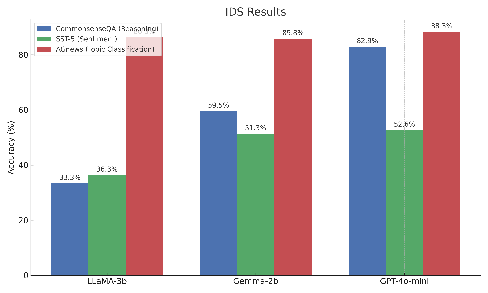
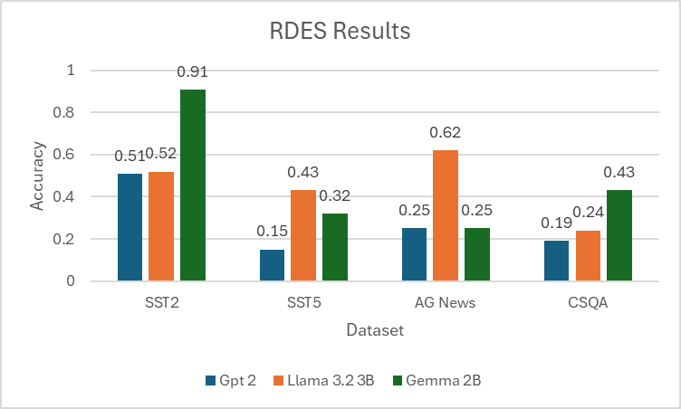
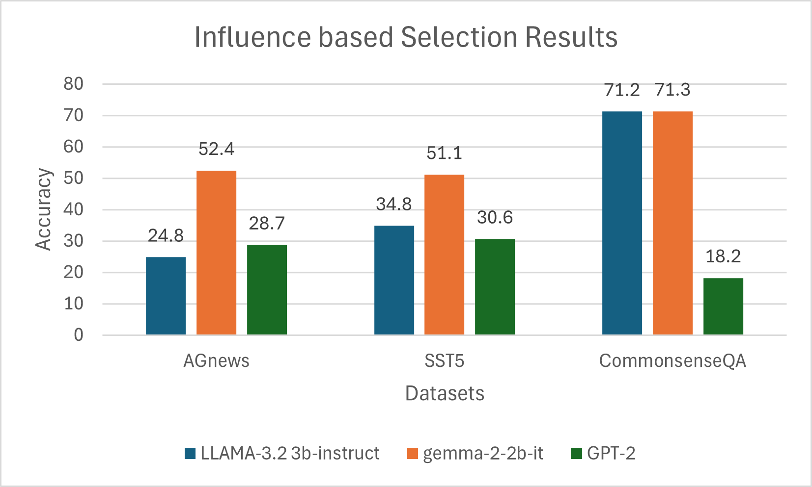
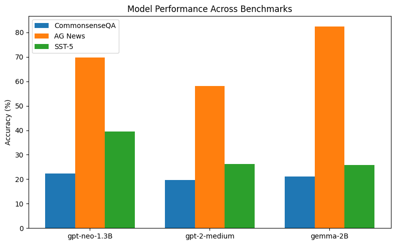
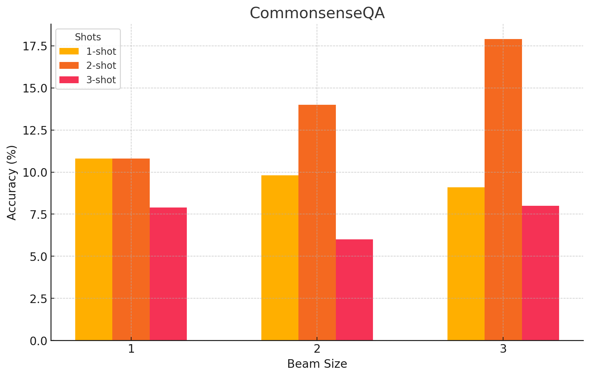
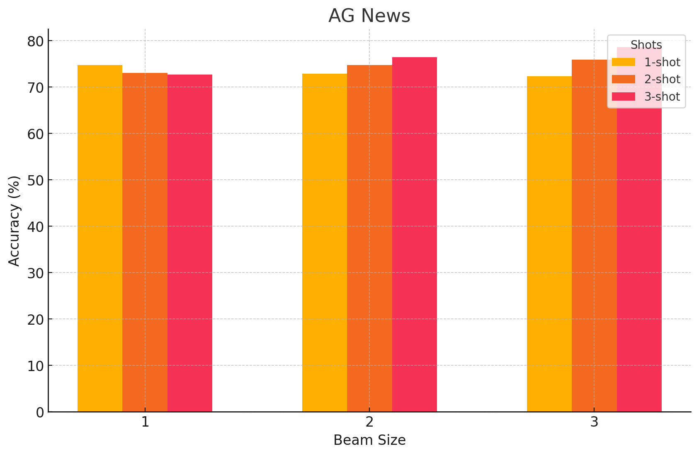
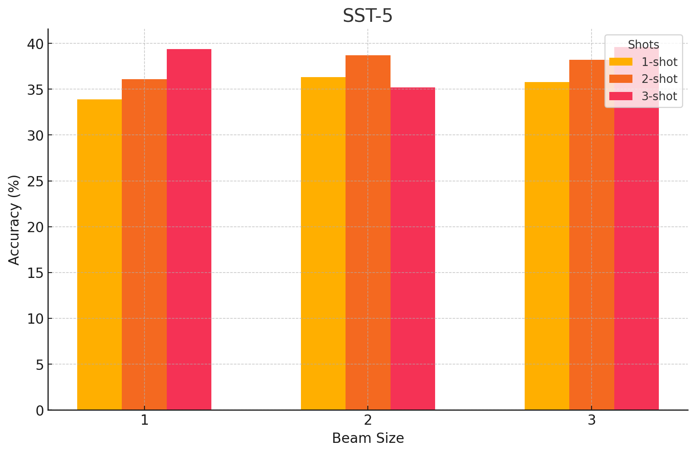
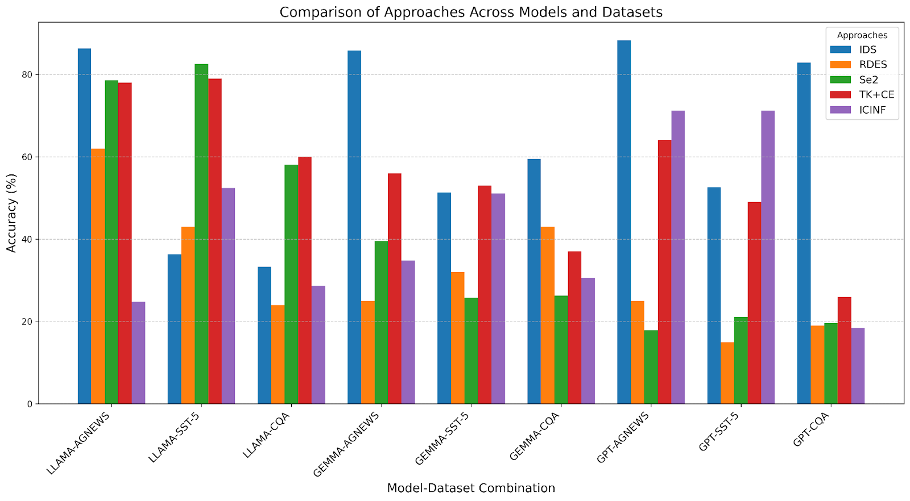

# Optimal-Demo-Selection-ICL

Implements and benchmarks optimal demonstration selection strategies in In-Context Learning (ICL) using large language models (LLMs). Strategies covered: IDS, RDES, Se², TopK+ConE, and Influence-based methods, evaluated across classification, reasoning, and QA tasks.

## Team Members 
- Kamisetty Yamini Preethi • yamini_preethi_k@tamu.edu  
- Jonathan Tong • tongjo@tamu.edu  
- Satvik Praveen • satvikpraveen_164@tamu.edu  
- Vinay Chandra Bandi • vinaychandra@tamu.edu  

## Table of Contents

1. [Project Overview](#project-overview)  
2. [Selection Strategies](#selection-strategies)  
3. [Models & Datasets](#models--datasets)  
4. [Experiment Results](#experiment-results)
   - [TopK + ConE Results](#topk--cone-performance)
   - [Iterative Demonstration Selection (IDS)](#iterative-demonstration-selection-ids)
   - [Reinforcement Demonstration Selection (RDES)](#reinforcement-demonstration-selection-rdes)
   - [Sequential Example Selection (Se²) Across Models](#se²-across-models)
   - [Se² with LLaMA-3.2-3B](#se²-with-llama-3.2-3b-commonsenseqa-ag-news-sst-5)
   - [Influence-based Selection Results](#influence-based-selection-performance)
   - [Overall Method Comparison](#comparison-of-all-methods)
5. [Usage](#usage)  
6. [Repository Structure](#repository-structure)  

---

## Project Overview

This repository supports research on demonstration selection for ICL. We investigate how relevance, diversity, and ordering of examples affect LLM performance.

---

## Selection Strategies

- **TopK + ConE** — Quantifies each example’s information gain (Peng et al.).  
- **IDS** — Iterative refinement via zero-shot Chain-of-Thought (Qin et al.).  
- **RDES** — Reinforcement-learning to balance relevance & diversity (Wang et al.).  
- **Se²** — Sequential-aware selection with beam search (Lu et al.).  
- **Influence** — Selects examples by their influence score on model outputs (Nguyen & Wong, 2023).  

---

## Models & Datasets

**Models**  
- LLaMA-3.2-3B  
- GPT-2 (medium)  
- GPT Neo
- Gemma-2B

**Datasets**  
- **SST-5**: 5-class sentiment classification  
- **AG News**: 4-way topic classification  
- **CommonsenseQA**: multiple-choice QA  
- (Also: CR, Subj, MNLI, QNLI, GSM8K, LogiQA, BoolQ)

---

## Experiment Results

### TopK + ConE Performance

| Model          | AG News | SST-5 | CommonsenseQA |
| -------------- | :-----: | :---: | :-----------: |
| LLaMA-3.2-3b   |  0.786  | 0.567 |     0.640     |
| Gemma-2-2b     |  0.790  | 0.530 |     0.496     |
| GPT-2 (100 M)  |  0.603  | 0.370 |     0.260     |
---

### IDS Performance (averaged over 3 splits)

| Model         | AG News | SST-5 | CommonsenseQA |
|---------------|:-------:|:-----:|:-------------:|
| GPT-4o-mini   |  0.88   | 0.68  |     0.829     |
| Gemma-2B-it   |  0.85   | 0.62  |     0.590     |
| LLaMA-3.2-3B  |  0.82   | 0.57  |     0.540     |


---

### RDES Performance

| Model        | SST-2  | SST-5   | AG News  | CommonsenseQA |
|--------------|:------:|:-------:|:--------:|:-------------:|
| GPT-2        |  0.51  | 0.1535  |  0.2534  |     0.19      |
| LLaMA-3.2-3B |  0.52  | 0.4351  |  0.6276  |     0.24      |
| Gemma-2B     |  0.91  | 0.3297  |  0.2500  |     0.4357    |


---

### Influence-Based Selection Performance

| Model        | AG News | SST-5  | CommonsenseQA |
|--------------|:-------:|:-----:|:-------------:|
| GPT-2        |  0.70   | 0.70  |     0.182     |
| LLaMA-3.2-3B |  0.25   | 0.27  |     0.710     |
| Gemma-2B     |  0.524  | 0.511 |     0.710     |


---

### 1. Se² Performance Across Model Architectures

| Model         | CommonsenseQA | AG News | SST-5 |
|---------------|--------------:|--------:|------:|
| GPT-Neo-1.3B   |        0.223  |   0.698 | 0.394 |
| GEMMA-2B      |        0.211  |   0.825 | 0.258 |
| GPT-2-medium  |        0.196  |   0.581 | 0.263 |



*Table:* Average Se² accuracy over three 100-example splits.  
*Figure:* Bar chart of Se² performance on CommonsenseQA, AG News, and SST-5.

---

### 2. LLaMA-3.2-3B Few-shot Results under Se²

#### CommonsenseQA

| Shot \& Beam | 1     | 2     | 3     |
|-------------:|------:|------:|------:|
| 1-shot       | 0.108 | 0.098 | 0.091 |
| 2-shot       | 0.108 | 0.140 | 0.179 |
| 3-shot       | 0.079 | 0.060 | 0.080 |



#### AG News

| Shot \& Beam |   1   |   2   |   3   |
|-------------:|------:|------:|------:|
| 1-shot       | 0.748 | 0.729 | 0.724 |
| 2-shot       | 0.731 | 0.748 | 0.759 |
| 3-shot       | 0.727 | 0.765 | 0.786 |



#### SST-5

| Shot \& Beam |  1    |  2    |  3    |
|-------------:|------:|------:|------:|
| 1-shot       | 0.339 | 0.363 | 0.358 |
| 2-shot       | 0.361 | 0.387 | 0.382 |
| 3-shot       | 0.394 | 0.352 | 0.396 |



*All values averaged over three random splits.*

---
### Summary: All Methods

| Method      | GPT-2  | LLaMA-3.2-3B | Gemma-2B |
|-------------|:------:|:------------:|:--------:|
| TopK+ConE   | 0.603  |    0.786     |  0.790   |
| IDS         | 0.880  |    0.820     |  0.850   |
| RDES        | 0.2534 |    0.6276    |  0.2500  |
| Se²         | 0.581  |    0.698     |  0.825   |
| Influence   | 0.700  |    0.250     |  0.524   |


---

## Repository Structure

```
Optimal-Demo-Selection-ICL/
├── Figures/            # added influence results plot, IDS, RDES, Se2 & TopK+CoNE plots
├── ICINF/              # influence code
├── IDS/                # IDF and ICINF code
├── RDES/               # Reinforcement Learning approach code ICL
├── SE2/                # notebook for experimenting with Meta LLAMA
├── TopK+CoNE/          # TK+CE code
├── .gitignore          # modified gitignore file
├── IDS.py              # sample code for IDS
├── LICENSE             # Initial commit
└── README.md           # Update README.md
```
