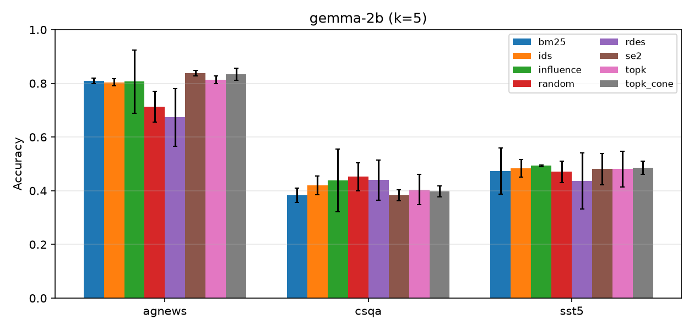
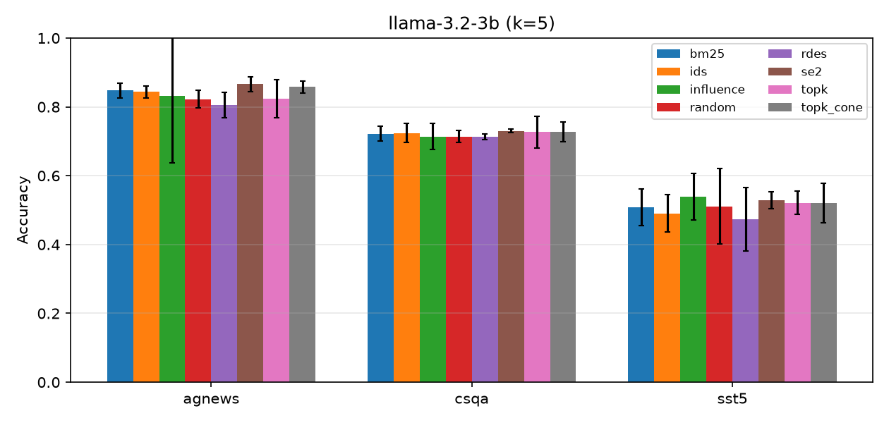
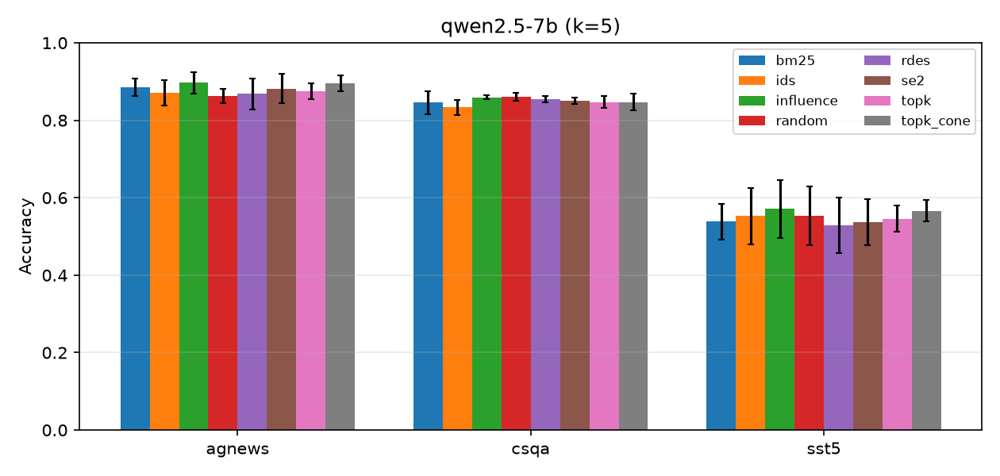

<div align="center">

# Optimal Demonstration Selection for In-Context Learning

**A reproducible benchmark of demonstration-selection methods for few-shot in-context learning.**

[](https://github.com/SatvikPraveen/Optimal-Demo-Selection-ICL/actions/workflows/tests.yml)
[](https://www.python.org/)
[](LICENSE)
[](https://github.com/psf/black)
[](https://github.com/astral-sh/ruff)
[](https://satvikpraveen.github.io/Optimal-Demo-Selection-ICL/)

[Overview](#overview) ·
[Installation](#installation) ·
[Quick Start](#quick-start) ·
[Benchmark](#running-the-benchmark) ·
[Protocol](#evaluation-protocol) ·
[Results](#results) ·
[Extending](#extending-the-benchmark) ·
[Citation](#citation)

**Documentation:** https://satvikpraveen.github.io/Optimal-Demo-Selection-ICL/

</div>

---

## Overview

Which examples go into a few-shot prompt matters as much as the model that reads it. This repository provides a
controlled setting in which to answer that question: eight selection strategies, three tasks and any causal language
model share **one prompt template, one prediction rule, one evaluation protocol and one configuration-driven
runner**. Every result is produced with confidence intervals, paired significance tests and a manifest that records
the exact code and library versions that generated it.

### Selection methods

| Method | Key idea | Reference | LM used during selection |
|:--|:--|:--|:--|
| `random` | Uniformly random demonstrations (lower bound) | — | — |
| `topk` | Nearest neighbours in sentence-embedding space (SBERT / kNN) | Liu et al., 2022 | — |
| `bm25` | Lexical retrieval with Okapi BM25 | Robertson & Zaragoza, 2009 | — |
| `topk_cone` | Top-K retrieval re-ranked by the conditional entropy of the query | Peng et al., 2024 | scorer |
| `ids` | Iterative retrieval guided by zero-shot chain-of-thought rationales | Qin et al., 2023 | evaluated model |
| `rdes` | Tabular Q-learning that balances relevance and label diversity | Wang et al., 2024 | — |
| `se2` | Sequential beam search over demonstration order, scored by the LM | Liu et al., 2024 | scorer |
| `influence` | Subset-sampling influence estimates; one fixed prompt for all queries | Nguyen & Wong, 2023 | evaluated model, once |

Algorithms, costs and every deliberate deviation from the original implementations are documented in
[`docs/methods.md`](docs/methods.md).

### Tasks and models

| | |
|:--|:--|
| **Tasks** | SST-5 (5-way sentiment) · AG News (4-way topic) · CommonsenseQA (5-way multiple choice) |
| **Local models** | Any `AutoModelForCausalLM` checkpoint via `HFCausalModel` (LLaMA, Gemma, GPT-2, GPT-Neo, …) |
| **API models** | OpenAI chat models via `GPTModel` (supported, but not part of the reported grid) |
| **Testing** | A deterministic `DummyModel` runs the entire pipeline in CI without weights, keys or a GPU |

### Evaluation

Accuracy and macro-F1 · percentile-bootstrap confidence intervals over test examples · mean ± std over seeds ·
exact McNemar and paired-bootstrap tests against a baseline · parse-failure rate · fit, selection and inference
cost in wall time, calls and tokens.

---

## Installation

Requires Python 3.10 or newer. A GPU is recommended for local models but not required.

```bash
git clone https://github.com/SatvikPraveen/Optimal-Demo-Selection-ICL.git
cd Optimal-Demo-Selection-ICL
./setup_env.sh                 # creates ./venv, installs the package with dev extras and pre-commit hooks
source venv/bin/activate
```

Or manually:

```bash
python -m venv venv && source venv/bin/activate
pip install -e ".[dev]"        # core + pytest, black, ruff, mypy, matplotlib
```

| Need | Command |
|:--|:--|
| Exact, pinned environment | `pip install -r requirements-lock.txt` |
| API keys and tokens | `cp .env.example .env`, then set `OPENAI_API_KEY` and `HF_TOKEN` |
| Jupyter support | `pip install -e ".[notebooks]"` |

---

## Quick Start

```python
from src.datasets import get_task, load_split, load_train_without_holdout
from src.evaluation import bootstrap_ci, compute_metrics
from src.models import HFCausalModel
from src.prompting import ICLInference, PromptBuilder
from src.selection import TopKCoNE
from src.utils import set_seed

set_seed(0)
task = get_task("sst5")
train_texts, train_labels = load_train_without_holdout(task, num_samples=500, seed=0)
test_texts, test_labels = load_split(task, "test", num_samples=100, seed=0)

model = HFCausalModel("gpt2")                                     # or GPTModel("gpt-4o-mini")
inference = ICLInference(model, PromptBuilder(task.instruction))  # ranks label log-probs for local models

selector = TopKCoNE(k=5, retrieve_k=30, scorer=model.scorer)      # any BaseSelector works here
selector.fit(task.format_demos(train_texts, train_labels), train_labels)

predictions = []
for text in test_texts:
    query = task.format_query(text)
    demos = [selector.candidates[i] for i in selector.select(query)]
    predictions.append(inference.predict(demos, query, task)["prediction"])

print(compute_metrics(predictions, test_labels))
print(bootstrap_ci([p == y for p, y in zip(predictions, test_labels)]))
```

---

## Running the Benchmark

Experiments are defined in [`configs/experiments.yaml`](configs/experiments.yaml) (benchmarks, defaults and
method hyper-parameters) and [`configs/models.yaml`](configs/models.yaml) (model registry).

```bash
# All eight methods on SST-5 with the dummy model. Runs in seconds; no GPU or API key.
python experiments/run_benchmark.py --benchmark smoke

# A real run on a local GPT-2 (first run downloads the checkpoint).
python experiments/run_benchmark.py --benchmark quick_test

# The full grid: 3 datasets × 3 local models × 8 methods × 3 seeds. Any setting can be overridden on the CLI.
python experiments/run_benchmark.py --benchmark full_benchmark --models llama-3.2-3b --seeds 0 1 2 --resume

# k-shot ablation (writes to results/raw/k{1,3,5,8}/).
python experiments/run_benchmark.py --benchmark ablation_k

# Tables and significance tests, then figures.
python experiments/aggregate_results.py --baseline random
python experiments/plot_results.py
```

`--dry-run` lists the runs a benchmark expands to. `--resume` skips runs whose result file already exists, so a
long grid can be interrupted and restarted.

### Outputs

Each run writes `results/raw/<dataset>__<model>__<method>__seed<seed>.json`:

| Section | Contents |
|:--|:--|
| `records` | Per test example: selected pool indices and their labels, prediction, gold label, raw model output |
| `metrics` | Accuracy, macro-F1, precision, recall, bootstrap 95 % CI, parse-failure rate |
| `cost` | Fit / selection / inference wall time; model calls and tokens for fitting and for evaluation; scorer passes |
| `selector`, `model`, `task`, `config` | Every hyper-parameter of the run |
| `manifest` | Git commit and dirty flag, Python and package versions, CUDA device |

`aggregate_results.py` writes `runs.csv`, `summary.csv`, `significance.csv` and `summary.md` to
`results/processed/`: mean ± std over seeds per dataset, model and method, and Δ accuracy against the baseline with
a paired-bootstrap interval and an exact McNemar *p*-value pooled over seeds.

---

## Evaluation Protocol

| Aspect | Design |
|:--|:--|
| **Splits** | The demonstration pool is sampled from the training split and kept disjoint from the validation slice (used only by `influence`) and the test set. CommonsenseQA's labeled validation split serves as its test set because the official test split is unlabeled. |
| **Prompts** | One template per task in `src/datasets/tasks.py`: an instruction, *k* demonstrations, then the query. |
| **Prediction** | Local models rank the label verbalizers by log *p*(label \| prompt). API models generate text that is mapped onto the label set by a documented decoding rule; unparseable outputs count as errors and are reported separately. |
| **Uncertainty** | Bootstrap CIs over test examples within a run; mean ± sample std and a *t*-interval over seeds; paired McNemar and bootstrap tests between methods evaluated on the same examples. |
| **Reproducibility** | `set_seed` seeds Python, NumPy and torch; every stochastic selector owns a seeded generator; every result file carries the commit hash and library versions. |

---

## Results

Full grid: **3 tasks × 3 local models × 8 methods × 3 seeds = 216 runs**, *k* = 5 demonstrations, a 2 000-example
demonstration pool and 500 test queries per run, label-likelihood prediction (no parse failures). Runs were executed on
A100, A40 and A6000 GPUs.

### Accuracy averaged over tasks

| Method | Gemma-2B | LLaMA-3.2-3B | Qwen2.5-7B | Overall | Sig. better / worse than Random | Selection cost (s / query) |
|:--|:--:|:--:|:--:|:--:|:--:|:--:|
| Influence | 0.579 | 0.695 | 0.776 | **0.683** | 3 / 0 | 8.01 † |
| TopK + ConE | 0.573 | 0.702 | 0.770 | **0.681** | 3 / 1 | 0.25 |
| Se² | 0.568 | 0.708 | 0.757 | **0.678** | 3 / 1 | 2.13 |
| Top-K (SBERT) | 0.566 | 0.691 | 0.756 | **0.671** | 1 / 1 | 0.01 |
| IDS | 0.569 | 0.686 | 0.753 | **0.669** | 2 / 2 | 7.21 |
| BM25 | 0.556 | 0.693 | 0.756 | **0.668** | 3 / 1 | 0.01 |
| Random | 0.545 | 0.682 | 0.759 | **0.662** | — | 0.00 |
| RDES | 0.517 | 0.664 | 0.750 | **0.644** | 0 / 4 | 0.01 |

"Sig. better / worse" counts the nine (task, model) pairs where the paired-bootstrap 95 % interval of Δ accuracy
excludes zero **and** the exact McNemar test gives *p* < 0.05, with per-example correctness pooled over the three
seeds (1 500 paired examples per test). † Influence selects one fixed prompt, so its cost is the one-off fit
(400 prompt subsets × 100 validation examples) amortised over the 500 test queries; IDS pays four model calls per query.

Per-task tables with seed standard deviations are in
[`results/processed/summary.md`](results/processed/summary.md), every paired test in
[`results/processed/significance.csv`](results/processed/significance.csv), and figures in
[`results/plots/`](results/plots/). The per-example predictions and selected demonstrations of all 216 runs are in
[`results/raw.tar.gz`](results/raw.tar.gz) (`tar xzf results/raw.tar.gz -C results` restores `results/raw/`).

<p align="center">
  
  
  
</p>
<p align="center"><em>Accuracy per task and method; error bars are 95 % t-intervals over three seeds.</em></p>

### Findings

1. **Selection matters, but modestly.** The best methods add about two points of average accuracy over random
   demonstrations (0.683 vs 0.662). Gains shrink as the model gets stronger: the best method beats Random by
   3.4 points on Gemma-2B, 2.6 on LLaMA-3.2-3B and 1.7 on Qwen2.5-7B.
2. **The effect is strongly task-dependent.** Topic classification (AG News) benefits most, up to +12.5 points
   for Se² on Gemma-2B. Sentiment (SST-5) gains are mostly within noise. On multiple-choice commonsense QA (CSQA),
   similarity-based retrieval *hurts* the weakest model (five methods significantly below Random on Gemma-2B) and
   is neutral on the others: similar-looking questions are not informative demonstrations for this task.
3. **TopK + ConE is the best accuracy–cost trade-off.** It is within 0.2 points of the top method overall, never
   far from the best on any model, and costs a quarter of a second per query.
4. **Influence has the highest average and is never significantly worse than Random**, but it is expensive to fit
   and its single fixed prompt makes it sensitive to the seed (for example ±0.078 on AG News with LLaMA-3.2-3B).
5. **LM-in-the-loop selection does not pay for itself.** IDS spends about 7 s of generation per query and is not
   better than plain Top-K retrieval; Se² helps on LLaMA-3.2-3B but is inconsistent elsewhere.
6. **RDES underperforms Random** on every model (significantly in four of nine settings). Its Q-table is shared
   across queries (see [`docs/methods.md`](docs/methods.md)), so the learned policy converges to diversity rather
   than relevance.

These results are for 5-shot prompts on small open models with label-likelihood prediction; the original
notebook numbers in [`docs/legacy_results.md`](docs/legacy_results.md) used different protocols and are not
comparable.

---

## Project Structure

```
configs/
├── experiments.yaml        benchmarks, defaults, method hyper-parameters
├── models.yaml             model registry (backend, checkpoint, kwargs)
└── datasets.yaml           dataset metadata (templates live in src/datasets/tasks.py)
experiments/
├── run_benchmark.py        configuration-driven runner, one JSON per run
├── aggregate_results.py    tables and significance tests
└── plot_results.py         accuracy bars with CIs, cost-vs-accuracy scatter
src/
├── datasets/               loaders (SST-5, AG News, CSQA) and the Task registry
├── models/                 BaseModel with usage tracking, HFCausalModel, GPTModel, DummyModel, LMScorer
├── selection/              BaseSelector, baselines, TopKCoNE, IDS, RDES, Se2, InfluenceSelection, registry
├── prompting/              PromptBuilder and ICLInference.predict
├── evaluation/             metrics, prediction parsing, statistics
└── utils/                  seeding, logging, shared Embedder, environment manifest
tests/                      pytest suite; all network boundaries are mocked
docs/                       methods.md, legacy_results.md
notebooks_archive/          original course-project notebooks (reference only)
Figures/ · paper/           figures and report from the original project
```

---

## Extending the Benchmark

| To add | Do this |
|:--|:--|
| **A selection method** | Subclass `src.selection.BaseSelector` and implement `fit`, `select` and `get_config`. Register it in `src/selection/registry.py` and add its hyper-parameters under `methods:` in `configs/experiments.yaml`. Selectors that need the language model take an `LMScorer` (log-likelihoods) or the IDS-style generation callbacks in `__init__`; the registry wires them up. |
| **A task** | Add a loader returning `(texts, labels)` and a `Task` entry (label names, instruction, input/output prefixes, split mapping) in `src/datasets/tasks.py`. |
| **A model** | Add an entry to `configs/models.yaml`; any `AutoModelForCausalLM` checkpoint works out of the box. Other backends subclass `BaseModel` and implement `_generate` (and `_score_choices` when log-probabilities are available). |

---

## Running on a Slurm cluster

`scripts/slurm/` contains the scripts used to run the full grid on a Slurm GPU cluster; they only assume Slurm,
`uv` and a shared HuggingFace cache, so they adapt to other clusters with a change of paths.

```bash
bash scripts/slurm/setup.sh                       # venv, package, pre-download datasets and checkpoints, smoke run
python scripts/slurm/grid.py                      # list the (dataset, model, method) cells and their array indices
sbatch --array=0-35 --gres=gpu:2 scripts/slurm/run_grid.sbatch  # 72 cells, 2 per job (one per GPU), all seeds, resumable
bash scripts/slurm/status.sh                      # queue state, finished runs per cell, errors in logs
```

## Development

```bash
pytest                                  # ~80 tests, a few seconds, no network access
ruff check src tests experiments
black --check src tests experiments
pre-commit install                      # runs both checks on every commit
python tests/verify_setup.py            # installation diagnostic
```

Continuous integration runs linting, the test suite on Python 3.10 and 3.11, and the smoke benchmark. The
documentation site is built with MkDocs from the README and `docs/` on every push to `main`
(`pip install -e ".[docs]" && python scripts/build_docs.py && mkdocs serve` to preview locally).
See [`CONTRIBUTING.md`](CONTRIBUTING.md) for the contribution workflow and [`CHANGELOG.md`](CHANGELOG.md) for
release notes.

---

## Citation

```bibtex
@misc{praveen2024optimal,
  title  = {Optimal Demonstration Selection for In-Context Learning},
  author = {Praveen, Satvik and Tong, Jonathan and Kamisetty, Yamini Preethi and Bandi, Vinay Chandra},
  year   = {2024},
  note   = {Texas A\&M University. \url{https://github.com/SatvikPraveen/Optimal-Demo-Selection-ICL}}
}
```

A [`CITATION.cff`](CITATION.cff) file is included for GitHub's *Cite this repository* button.

## Authors

Kamisetty Yamini Preethi · Jonathan Tong · Satvik Praveen · Vinay Chandra Bandi — Texas A&M University

## License

Released under the [MIT License](LICENSE).
